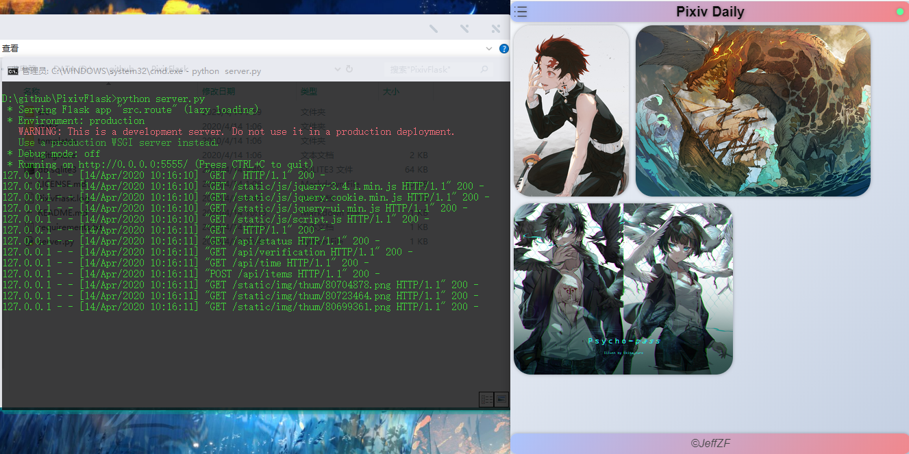
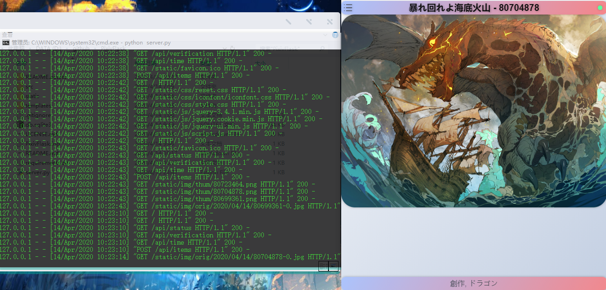
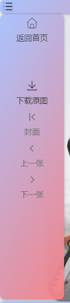
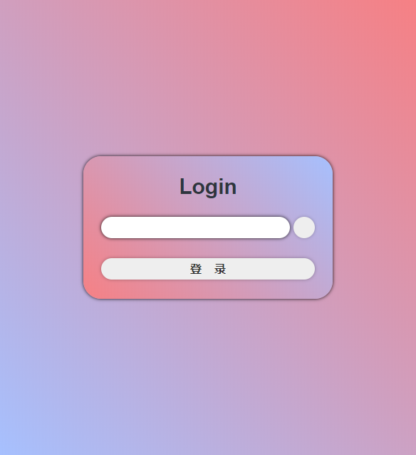

# PixivFlask

## 架构

前端：HTML5 + CSS(Less) + JavaScript(JQuery)  -  **不支持IE**

后端：Python3(Flask)

数据库：sqlite3

默认目录结构：

- /
  - server.py
  - db.sqlite3
  - PixivFlask.log
  - templates/
    - index.html
    - login.html
  - static/
    - css/...
    - img/
      - thum/...
      - orig/...
    - js/...
  - src/
    - \_\_init\_\_.py
    - config.py
    - define.py
    - db.py
    - deleteUnit.py
    - logger.py
    - pixiv.py
    - route.py
    - rsaUnit.py

## requirements

- pixivpy                   `P站API`
- apscheduler          `定时任务`
- pillow                     `图像处理`
- pycryptodome     `RSA`
- Flask                       `Web服务器`

```shell
pip3 install -r requirements.txt
```

国内可用镜像站下载

```shell
pip3 install -r requirements.txt -i https://mirrors.aliyun.com/pypi/simple/ --trusted-host mirrors.aliyun.com
```

## 效果图









## 用户配置

[/src/config.py](./src/config.py)

```python
# -*- coding: utf-8 -*-

from . import define
from os import path, makedirs
import logging
# 上面是库的导入，不用管


# 服务器设置
PORT = 5555  # 端口号
HOST = "0.0.0.0"  # 监听地址
DEBUG = False  # Flask的Debug模式，部署后不要开启
ALLOW_HOSTS = ["127.0.0.1:5555", "localhost:5555"]  # 允许访问的hosts

# 日志文件
LOGON = True  # 开启日志
LOGFILE = path.join(define.PATHDIR, "PixivFlask.log")  # 日志文件位置
LOGLEVEL = logging.WARNING  # 日志级别，详情查询python的logging模块

# 图片存放位置
# 与static文件夹的相对路径
# 请确保在static文件夹内，否则无法访问
IMGPATH = "img" # 更改之后前端的script.js也要更改，不建议更改

# 系统管理员密码
FLASK_PASSWORD = "passwd"  # 管理员密码，记得改

# pixiv账号密码
PIXIV_USERNAME = "username"  # P站账号
PIXIV_PASSWORD = "password"  # P站账号的密码

# 是否启用代理图床站(pixiv.cat)
USECAT = True  # 使用国内代理图床 - https://pixiv.cat/

# 排行榜每日下载时间设置
# P站排行榜刷新时间为日本的中午12:00，即北京时间上午11:00
APSTIME = {"hour": 12, "minute": 0}  # 排行榜定时爬取时间(hour、minute、second)

# 选择下载的类型
# MODELIST = ["day", "week", "month", "day_male", "day_female",
#             "week_original", "week_rookie", "day_manga", "day_r18", "day_male_r18",
#             "day_female_r18", "week_r18", "week_r18g"]
CHOICEMODE = ["day"]

# COUNT阈值，合集中超过多少张不下载，0为无限制
MAXCOUNT = 3 # 当插画集中插画数量大于3张时不下载。

```

## 运行

```shell
# 请先安装好requirements

python3 ./server.py

# 默认主页：http://127.0.0.1:5555
# 默认登录页面：http://127.0.0.1:5555/login
# 可通过修改./src/route.py文件更改URL
```

## API

### **获取定时下载器状态，查看是否正在下载**

- **Request :**

  | Key    | Value       |
  | ------ | ----------- |
  | Method | GET         |
  | Url    | /api/status |

- **Response :**

  | Key          | Value                                           |
  | ------------ | ----------------------------------------------- |
  | Content-Type | application/json                                |
  | Data         | { "errno":0, "msg":"Success!", "data":$status } |

### **获取图库的时间列表**

- **Request :**

  | Key    | Value     |
  | ------ | --------- |
  | Method | GET       |
  | Url    | /api/time |

- **Response :**

  | Key          | Value                                                        |
  | ------------ | ------------------------------------------------------------ |
  | Content-Type | application/json                                             |
  | Data         | { "errno":0, "msg":"Success!", "data":[ $time1, $time2, ... ] } |
  | $time{id}    | 年月日组成的 Integer ，如20200101。                          |

### **获取插画集信息**

- **Request :**

  | Key          | Value                                                        |
  | ------------ | ------------------------------------------------------------ |
  | Method       | POST                                                         |
  | Url          | /api/items                                                   |
  | Content-Type | application/json                                             |
  | Data         | { "time":$time, "typelist":$typelist, "category":$category } |
  | $time        | 年月日组成的 Integer ，如 20200101 。特殊情况： 0 为所有，非法值或不填为最后一天 |
  | $typelist    | 由选定类型组成的 list ，详情见"**用户配置**"的"**MODELIST**"注释 |
  | $category    | 如果不指定 $typelist ，则需要 $category ，表示一个大类，是一个字符串，可选值有："NORMAL"、"R18"、"ALL" |

- **Response :**

  | Key          | Value                                                        |
  | ------------ | ------------------------------------------------------------ |
  | Content-Type | application/json                                             |
  | Data         | { "errno":0, "msg":"Success!", "data":{ $time1:[ $item1, $item2, ... ], $time2:[ ... ], ... } } } |
  | $time{id}    | 年月日组成的Integer，如20200101。                            |
  | $item{id}    | JSON数据，表示插画集信息。 { "illust":$illust, "title":$title, "suffix":$suffix, "tags":$tags } |
  | $illust      | 插画 id ，是一个 Interger ，如 80723464 。                   |
  | $title       | 标题， String ，如 "暴れ回れよ海底火山"。                    |
  | $suffix      | 图片的后缀， String ，如 "png"。                             |
  | $tags        | 插画集的标签，List ，如 ["PSYCHO-PASS", "狡噛慎也", "常守朱", "PSYCHO-PASS1000users入り", "煙草", "PSYCHO-PASS10000users入り"] |

### **获取登录公钥**

- **Request :**

  | Key    | Value      |
  | ------ | ---------- |
  | Method | GET        |
  | Url    | /api/login |

- **Response :**

  | Key          | Value                                                        |
  | ------------ | ------------------------------------------------------------ |
  | Content-Type | application/json                                             |
  | Data         | { "errno":0, "msg":"Success!", "data":{ "keyno":$keyno, "key":$key } } |
  | $keyno       | 公钥序号，Interger                                           |
  | $key         | 公钥，String                                                 |

### **登录**

- **Request :**

  | Key          | Value                                    |
  | ------------ | ---------------------------------------- |
  | Method       | POST                                     |
  | Url          | /api/login                               |
  | Data         | { "keyno":$keyno, "password":$password } |
  | $keyno       | 公钥序号，Interger                       |
  | $password    | 经过RSA加密后的密码，base64，String      |
  | Content-Type | application/json                         |

- **Response :**

  | Key          | Value                                        |
  | ------------ | -------------------------------------------- |
  | Content-Type | application/json                             |
  | Data         | { "errno":$errno, "msg":"...", "data":null } |
  | $errno       | 0 则登录成功，5 则密码错误。                 |

### **验证登录状态**

- **Request :**

  | Key     | Value              |
  | ------- | ------------------ |
  | Method  | GET/POST           |
  | Url     | /api/verification  |
  | Cookies | AuthCert=$AuthCert |

- **Response :**

  | Key          | Value                                        |
  | ------------ | -------------------------------------------- |
  | Content-Type | application/json                             |
  | Data         | { "errno":$errno, "msg":"...", "data":null } |
  | $errno       | 0 则登录成功，5 则密码错误。                 |


### **注销**

- **Request :**

  | Key     | Value              |
  | ------- | ------------------ |
  | Method  | GET/POST           |
  | Url     | /api/logout        |
  | Cookies | AuthCert=$AuthCert |

- **Response :**

  | Key          | Value                                        |
  | ------------ | -------------------------------------------- |
  | Content-Type | application/json                             |
  | Data         | { "errno":$errno, "msg":"...", "data":null } |
  | $errno       | 0 则注销成功，6 则未登录。                   |

### **删除插画集**

- **Request :**

  | Key          | Value                                      |
  | ------------ | ------------------------------------------ |
  | Method       | POST                                       |
  | Url          | /api/delete                                |
  | Cookies      | AuthCert=$AuthCert                         |
  | Data         | { "type":0, "illust":$illust }             |
  | $illust      | 插画 id ，是一个 Interger ，如 80723464 。 |
  | Content-Type | application/json                           |

- **Response :**

  | Key          | Value                                        |
  | ------------ | -------------------------------------------- |
  | Content-Type | application/json                             |
  | Data         | { "errno":$errno, "msg":"...", "data":null } |
  | $errno       | 0 则删除成功，2 则数据库错误。               |

详细接口见 [/src/route.py](./src/route.py) 文件

## 留言

喜欢的可以点个star和fork，有问题可以提交到issue。